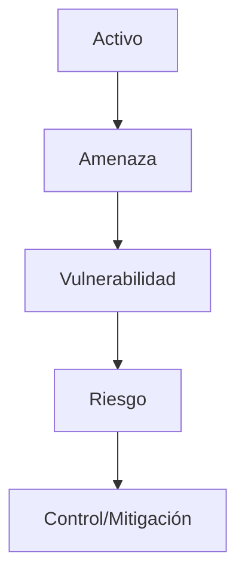

# Backdoors, Bombas Lógicas y Keyloggers

Un **backdoor** (puerta trasera) es un mecanismo que permite acceder a un sistema o dispositivo directamente, saltándose las medidas de seguridad regulares (como la autenticación de usuario) que se han implementado. 

Puede tomar varias formas: 
- Una parte escondida dentro del código de un programa legítimo.
- Un programa independiente instalado furtivamente.
- Código incrustado dentro del firmware o como parte del núcleo de un sistema operativo. 

> [!info] Explicación: Uso de Backdoors
> Aunque usualmente son maliciosos, a veces los backdoors son implementados por los propios fabricantes con "fines buenos". Por ejemplo, para dar soporte al cliente, permitiendo al personal técnico autorizado ingresar al sistema rápidamente y proveer la ayuda necesaria sin requerir las contraseñas del usuario. Sin embargo, esto representa un riesgo de seguridad crítico si un atacante lo descubre.

En la mayoría de los casos maliciosos, un backdoor es introducido al sistema a través de un virus tipo **troyano**.

> [!info] Explicación: Bomba Lógica y Keylogger
> Para complementar el título del documento:
> - **Bomba Lógica:** Es un tipo de malware que permanece inactivo y oculto hasta que se cumple una condición o evento específico (ej. que llegue el día viernes 13, o que un empleado sea borrado de la base de datos de nómina). Al activarse, ejecuta su código malicioso.
> - **Keylogger:** Es una herramienta (software o dispositivo USB de hardware) diseñada para registrar de forma secreta cada tecla que presiona el usuario. Se utiliza principalmente para robar contraseñas, correos y números de tarjetas de crédito.

## Notas relacionadas
- [[fundamentos de seguridad]]
- [[seguridad informatica]]
- [[ataques a contraseñas]]

## Diagrama de Referencia

