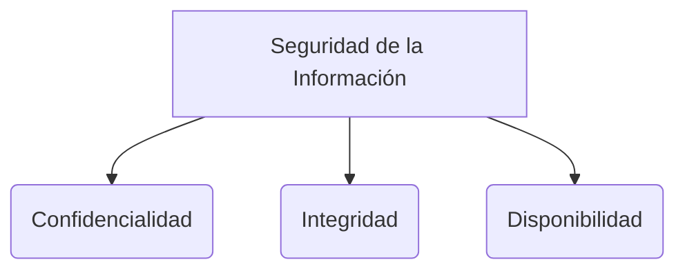

**Amenaza:** Es un evento probable que pueda ocurrir; es algo que no se puede controlar. Una amenaza nunca se vuelve real hasta que explota una vulnerabilidad. Representa un potencial problema para la seguridad de un activo.

**Vulnerabilidad:** Es una debilidad interna. Es imposible que un sistema no tenga vulnerabilidades.

**Riesgo:** Es la probabilidad de que una amenaza se vuelva realidad y el nivel de impacto que esta podría causar. El valor del activo influye en el nivel de riesgo.

**Ataque:** Es la acción que ocurre cuando se materializa una amenaza, aprovechándose de las vulnerabilidades existentes.

Desde la perspectiva de la seguridad informática, se deben proteger principalmente estos cuatro activos:
1. Hardware
2. Software y firmware
3. Datos
4. Telecomunicaciones

*Nota:* Ningún protocolo de TCP/IP es inherentemente seguro.

> [!info] Explicación: Conceptos Básicos de seguridad
> - **Amenaza vs Vulnerabilidad:** Piensa en la amenaza como un ladrón en el vecindario y la vulnerabilidad como una puerta sin seguro. El riesgo es la probabilidad de que el ladrón abra esa puerta y te robe (impacto).
> - **Activos:** Proteger el hardware y software es esencial, pero los datos suelen ser el activo más valioso de una organización.

## Malware
Software malicioso. Se caracteriza por su mecanismo de propagación (cómo se mueve de un sistema a otro) y su payload (la carga dañina que ejecuta).

- **Virus:** Es un subconjunto del malware que se adjunta a una aplicación anfitriona. No es un ejecutable completo; cuando se ejecuta la aplicación anfitriona, también se ejecuta el código del virus. El virus no puede propagarse por sí mismo, requiere de algún tipo de acción del usuario.
- **Gusanos (Worms):** Se replican a sí mismos y se propagan a través de la red sin la necesidad de una aplicación anfitriona o interacción del usuario. Pueden causar sobrecarga del ancho de banda de la red. Por ejemplo, Stuxnet, que infectó una instalación nuclear iraní.
- **Caballo de Troya (Troyano):** Malware que se oculta dentro de algo legítimo. Pretende ofrecer una funcionalidad beneficiosa, pero ejecuta procesos maliciosos en segundo plano.
  - **RAT (Remote Access Trojan):** Permite al atacante controlar el sistema infectado a través de la red. Algunos recolectan pulsaciones de teclados, nombres de usuario/contraseñas, correos electrónicos e historial de navegación.

> [!info] Explicación: Diferencias en Malware
> - **Virus:** Necesita de ti para moverse (ej. abrir un archivo de Word infectado).
> - **Gusano:** Es autónomo. Una vez dentro de la red, busca otras máquinas vulnerables y salta hacia ellas.
> - **Troyano:** Entra con engaños (ej. descargas un juego gratis, pero trae un software de control remoto oculto).

- **Adware:**
  - *No malicioso:* Software que muestra publicidad a cambio del uso gratuito de una aplicación.
  - *Malicioso:* Muestra publicidad legítima mezclada con otra publicidad engañosa. Puede ser peligroso dependiendo del tipo de publicidad cargada, ya que podría mostrar contenido inadecuado o redireccionar a sitios web con contenido peligroso.
- **Spyware:** Recolecta información almacenada en el computador sin el conocimiento o consentimiento del usuario.
- **Ransomware:** Su popularidad creció con las criptomonedas. Es un malware que bloquea el computador o cifra la información del usuario hasta que se pague un valor de rescate.
- **Bomba lógica:** Malware que está configurado para ejecutar un payload cuando se cumplen ciertas condiciones específicas.
- **Bomba de tiempo:** Es una bomba lógica que se activa en una fecha u hora determinada.
- **Keylogger:** Software o dispositivo de hardware que captura y guarda todas las pulsaciones que el usuario realiza en el teclado.

> [!info] Explicación: Ransomware y Keyloggers
> - **Ransomware:** Es el ataque más lucrativo actualmente. Cifra los archivos del disco duro (usa criptografía) y exige un pago (generalmente en Bitcoin) a cambio de la llave para descifrarlos.
> - **Keylogger:** Puede ser un programa oculto o incluso un pequeño conector USB conectado entre el teclado y la PC. Es usado primariamente para robar credenciales bancarias y contraseñas.

- **Botnet:** Conjunto de dispositivos infectados por algún malware que están bajo el control central de un atacante (botmaster). Los dueños de botnets buscan beneficios económicos y pueden utilizarlas para enviar spam, ejecutar ataques de denegación de servicio distribuido (DDoS), minar criptomonedas o realizar ataques de fuerza bruta.
- **Rootkit:** Malware que permite el acceso a un dispositivo en modo de sistema (kernel) y mantiene su presencia oculta corrompiendo el sistema operativo o sus aplicaciones. 
  - Un programa común se ejecuta en modo de usuario (privilegios limitados).
  - Un rootkit se ejecuta en modo de sistema o kernel (altos privilegios) y puede modificar procesos y registros para no ser detectado.
- **Malware blindado (Armored Malware):** Malware diseñado para que sea difícil realizarle ingeniería inversa. Utilizan métodos como escribir el código en lenguaje ensamblador con técnicas de ofuscación para ocultar la verdadera intención del malware.

## Clasificación de los atacantes

### Por nivel de conocimiento
- **Script Kiddies:** Atacantes novatos que utilizan herramientas o scripts creados por otros sin entender completamente cómo funcionan.

### Por intenciones o motivaciones del atacante
#### Criminales
Atacantes que cometen actos ilegales en el mundo cibernético. Realizan ataques normalmente para obtener dinero. Utilizan medios como la Dark Web y criptomonedas (Bitcoin) para monetizar sus acciones y se esconden en el anonimato. Ejecutan actos como fraude, extorsión, robo y falsificación.

#### Hacktivistas
Hacktivista = Hacker + Activista. Atacan para avanzar en una agenda política o social; atacan para promover o defender una causa.

> [!info] Explicación: Deep Web vs Dark Web
> - **Deep Web:** Es simplemente todo el contenido de internet que no es indexado por los motores de búsqueda (como tu bandeja de entrada de correo o sistemas cerrados corporativos).
> - **Dark Web:** Es una pequeña porción de la Deep Web que requiere navegadores especializados (como Tor) para acceder, y donde suele ocurrir actividad ilegal u oculta.

#### Competencia
Ejecutan espionaje corporativo o ataques para hacer daño a la competencia. Algunas empresas buscan información que les otorgue una ventaja competitiva en el mercado.

#### Amenazas Persistentes Avanzadas (APT - Advanced Persistent Threats)
- **Avanzadas:** Porque están compuestas por expertos altamente calificados.
- **Persistentes:** Porque trabajan metódicamente, a largo plazo y están bien financiados (muchas veces por gobiernos).
- Emplean herramientas extremadamente avanzadas y técnicas que son muy difíciles de detectar y contrarrestar.

### Origen del atacante
#### Internos
Atacantes que provienen de dentro de la organización (empleados descontentos, ex-empleados con accesos no revocados).
#### Externos
Atacantes que operan desde fuera de la red de la organización.

## Notas relacionadas
- [[seguridad informatica]]
- [[metodologias de analisis y evaluacion de riesgo]]
- [[ataques a contraseñas]]
- [[protocolos criptograficos]]
- [[Ingenieria social]]

## Diagrama de Referencia

