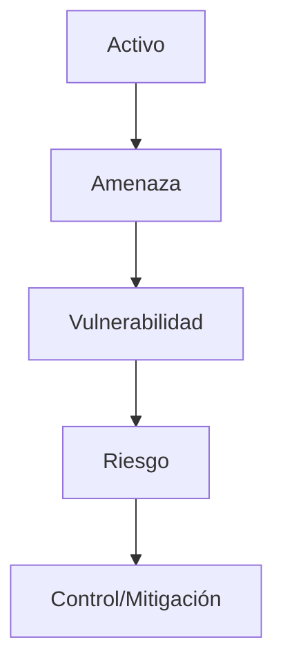

# Protocolo Needham-Schroeder (N-S)

Muchos protocolos de seguridad modernos derivaron de la propuesta de Needham-Schroeder, incluyendo el sistema **Kerberos**. Estos protocolos utilizan encriptación simétrica para proteger la información.

El protocolo **N-S** es un protocolo de autenticación basado en un servidor de confianza. Está diseñado para generar y propagar de forma segura una **llave de sesión** (una llave simétrica temporal) entre dos partes, para que puedan tener una comunicación subsecuente encriptada simétricamente.

Para garantizar la frescura de los mensajes y evitar ataques, el protocolo N-S usa **Nonces** (*Numbers used once*). Son números generados aleatoriamente o pseudoaleatoriamente que se usan una sola vez para evitar el **Replay Attack** (ataque de repetición).

> [!info] Explicación: Replay Attack y Prevención
> Un atacante podría interceptar un mensaje cifrado antiguo válido (por ejemplo, "transferir $100") y volver a enviarlo más tarde. Para evitar esto, existen dos soluciones principales:
> 1. **Timestamping (Marcas de tiempo):** Los dos lados de la comunicación deben tener sus relojes perfectamente sincronizados. Cada paquete tiene la fecha y hora de creación y un periodo de expiración muy corto. Si el paquete llega tarde, es rechazado.
> 2. **Nonces:** Se envía un número aleatorio único en la solicitud, y el servidor debe incluir ese mismo número en la respuesta cifrada. Así se garantiza que la respuesta es para *esa* petición específica y no un mensaje antiguo. *Nota: Un nonce es simplemente un número de un solo uso, no está basado en la hora local como el timestamp.*

En el esquema básico del protocolo, los usuarios **A** y **B** no comparten una llave entre ellos directamente, pero ambos tienen una comunicación simétrica segura con un servidor central de confianza **S**, usando sus respectivas llaves pre-compartidas **Kas** y **Kbs**. El servidor **S** es quien se encarga de generar la llave de sesión y distribuirla a A y B.

## Notas relacionadas
- [[protocolos criptograficos]]
- [[seguridad informatica]]
- [[ataques a contraseñas]]
- [[protocolo N-S]]

## Diagrama de Referencia

