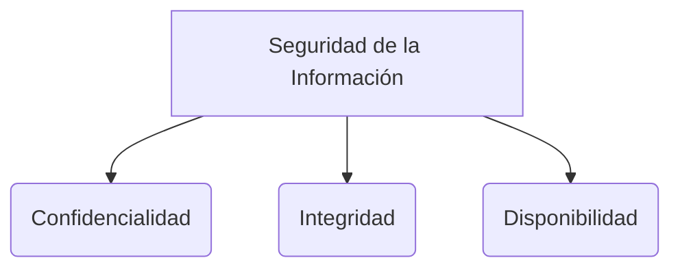

# Protocolos Criptográficos

Un protocolo de red regular es un diálogo estructurado entre dos o más entidades en un contexto distribuido, el cual controla:
- **La sintaxis:** La estructura y formato exacto de los datos.
- **La semántica:** El significado específico que tienen estas estructuras.
- **La sincronización:** La coordinación en el tiempo (y orden de los mensajes) para que las entidades se puedan entender. 

Un **protocolo criptográfico** es un tipo de protocolo que aplica mecanismos y algoritmos de seguridad para lograr una función de protección específica en las comunicaciones.

## Objetivos principales
- **Autenticación / Unicidad:** Garantiza que un secreto es compartido y conocido exclusivamente entre dos entidades autorizadas.
- **Integridad:** Asegura que el mensaje no ha sido alterado durante el tránsito y provee verificación de su origen.
- **Confidencialidad:** Garantiza que el contenido del mensaje se mantiene en secreto y no es accesible por una persona no autorizada. 
- **No repudio de origen:** El transmisor no puede negar falsamente haber enviado un mensaje. 
- **No repudio de destino:** El receptor no puede negar falsamente haber recibido un mensaje.

> [!info] Explicación: No Repudio
> El concepto de *No Repudio* suele lograrse usando **Criptografía Asimétrica** (firmas digitales). Al firmar un documento con su llave privada única, el emisor está atado criptográficamente a ese documento, dando validez legal y técnica al envío.

## Fundamentos
Todos los protocolos criptográficos comparten características esenciales:
1. Siempre existen entidades (nodos, usuarios, servidores) que están intercambiando mensajes.
2. Estas entidades intentan lograr funciones de seguridad específicas para proteger su comunicación.
3. Se asume que las entidades están operando en un ambiente hostil e inseguro (como internet), donde el tráfico puede ser interceptado o modificado.

Por ende, el protocolo debe ser inherentemente robusto y confiable para enfrentarse a un determinado perfil de atacante. Involucra una secuencia de intercambio de mensajes que comúnmente se anota de la siguiente forma formal:

- `A -> B : M` (La entidad A envía el mensaje M a la entidad B)
- `{M}k` (Representa el mensaje M encriptado simétricamente con la llave k)

## Ataques comunes a protocolos
- **Known-key attack (Ataque de clave conocida):** El atacante logra obtener algunas claves usadas en sesiones anteriores y utiliza esta información para intentar descifrar comunicaciones actuales o futuras.
- **Replay attack (Ataque de repetición):** El atacante intercepta y guarda mensajes encriptados válidos para retransmitirlos y reutilizarlos después maliciosamente.
- **Impersonation (Suplantación de identidad):** El atacante asume la identidad de una de las entidades legítimas de la red para engañar a los demás.
- **Man in the middle (Hombre en el medio):** El atacante se interpone secretamente entre dos entidades, interceptando, leyendo y posiblemente alterando la comunicación entre ambas.
- **Interleaving attack:** El atacante inyecta o intercala mensajes espurios o adulterados dentro del flujo normal de un protocolo para interrumpirlo o subvertir su lógica.

## Notas relacionadas
- [[protocolo needham schroeder]]
- [[seguridad informatica]]
- [[fundamentos de seguridad]]
- [[ataques a contraseñas]]

## Diagrama de Referencia

