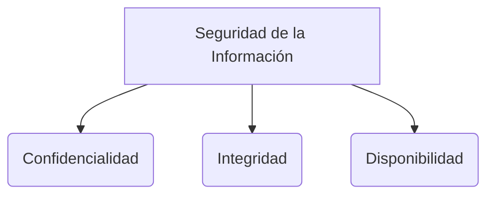

# La Triada de la seguridad Informática

La **Triada CIA** (por sus siglas en inglés: Confidentiality, Integrity, Availability) indica los tres principales pilares y objetivos de la seguridad de la información: Confidencialidad, Integridad y Disponibilidad.

> [!info] Explicación: La Triada CIA
> Todo sistema de gestión de seguridad se diseña buscando proteger al menos uno de estos tres pilares. Un ataque exitoso siempre compromete como mínimo uno de ellos.

### Confidencialidad 
Garantiza que la información se mantenga en secreto y evita que sea divulgada a personas o sistemas sin autorización.

**Las soluciones más comunes para protegerla son:**
1. **El cifrado (Encriptación):** Ocultar el contenido de los datos transformándolos en texto ininteligible usando algoritmos criptográficos.
2. **Control de acceso:** Restringir quién puede ver la información mediante autenticación (uso de nombre de usuario y contraseñas, biometría, etc.).
3. **Esteganografía:** Es la técnica de ocultar información secreta dentro de un archivo aparentemente inofensivo (como esconder un mensaje de texto dentro de los píxeles de una imagen).

### Integridad
Asegura que la información sea precisa y completa, previniendo que sea alterada, modificada o destruida por personas no autorizadas. 

**Las soluciones más comunes para mantenerla son:**
1. **Funciones Hash:** Algoritmos que toman una entrada de datos de cualquier tamaño y siempre devuelven una huella digital de una cantidad fija de bits. Si el archivo cambia mínimamente, el hash cambia por completo. 
   - Ejemplos de algoritmos: *MD5* (devuelve 128 bits, aunque es considerado obsoleto) y *SHA-1* (devuelve 160 bits).
2. **Firmas Digitales:** Proporcionan autenticidad e integridad comprobando que un mensaje no fue alterado y proviene del autor esperado.
3. **Certificados Digitales:** Verifican la identidad de entidades en la red usando criptografía asimétrica.

### Disponibilidad
Asegura que la información, los sistemas y los recursos de red estén operativos y sean accesibles en el momento deseado por los usuarios autorizados.

**Las soluciones más comunes para asegurarla son:**
- **Redundancia:** Tener componentes duplicados (como múltiples servidores o discos duros en RAID) que pueden tomar el control si un componente principal falla.
- **Tolerancia a fallos:** Diseño del sistema que le permite seguir funcionando correctamente incluso en presencia de fallas de hardware o software.

## Notas relacionadas
- [[fundamentos de seguridad]]
- [[control de acceso]]
- [[protocolos criptograficos]]
- [[SGSI]]
- [[repaso prueba]]

## Diagrama de Referencia

